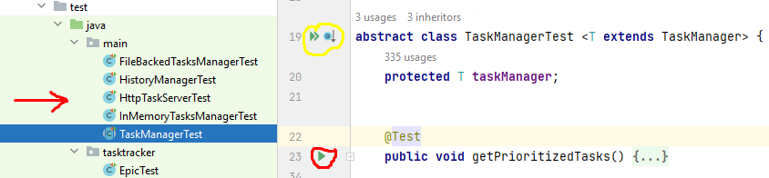

## Task manager

#### (англ. "Менеджер задач")

### REST приложение на основе Java Core для организации совместной работы над задачами

###### Приложение разработано в рамках прохождения учебного курса [Java-разработчик от Яндекс.Практикум](https://practicum.yandex.ru/java-developer/)

## Идея

Как человек обычно делает покупки? Если ему нужен не один продукт, а несколько, то очень вероятно,
что сначала он составит список, чтобы ничего не забыть. Сделать это можно где угодно: на листе
бумаги, в приложении для заметок или, например, в сообщении самому себе в мессенджере.
А теперь представьте, что это список не продуктов, а полноценных дел. И не каких-нибудь простых
вроде «помыть посуду» или «позвонить бабушке», а сложных — например, «организовать большой семейный
праздник» или «купить квартиру». Каждая из таких задач может разбиваться на несколько этапов со
своими нюансами и сроками. А если над их выполнением будет работать не один человек, а целая
команда, то организация процесса станет ещё сложнее. Это приложение позволяет решить эти проблемы.
Вариант интерфейса приложения представлен ниже.
 

## Основа

Задачи могут быть трёх типов: **обычные задачи, эпики и подзадачи**.
Простейшим кирпичиком такой системы является **задача** (англ. task). У задачи есть следующие
_свойства_:
 - **Название**, кратко описывающее суть задачи (например, «Переезд»).
 - **Описание**, в котором раскрываются детали.
 - **Уникальный идентификационный номер** задачи, по которому её можно будет найти.
 - **Статус**, отображающий её прогресс.
 Выделяем следующие этапы жизни задачи:
 **NEW** — задача только создана, но к её выполнению ещё не приступили.
 **IN_PROGRESS** — над задачей ведётся работа.
 **DONE** — задача выполнена.
 Иногда для выполнения какой-нибудь масштабной задачи её лучше разбить на **подзадачи** (англ.
subtask).
Большую задачу, которая делится на подзадачи, мы будем называть **эпиком** (англ. epic).
 Кроме классов для описания задач, ещё есть класс для объекта-менеджера. Он запускается на
старте программы и управляет всеми задачами.

## Функционал

Возможности для :
1) **задач**:
   - создание новой задачи (данные о новой задаче передаются в теле запроса на эндпоинт 
     `POST /tasks/task`)
   - обновление задачи (данные для обновления задачи передаются в теле запроса на эндпоинт
     `POST /tasks/task/?id=`, параметром запроса `?id=` указывается идентификатор задачи, которую 
     нужно обновить)
   - получение списка всех задач (эндпоинт `GET /tasks/task`)
   - получение задачи по идентификатору (идентификатор задачи передаётся параметром запроса `?id=` 
     на эндпоинт `GET /tasks/task`)
   - удаление всех задач (эндпоинт `DELETE /tasks/task`)
   - удаление задачи по идентификатору (идентификатор задачи передаётся параметром запроса `?id=` на
     эндпоинт `DELETE /tasks/task`)
2) **подзадач**:
   - создание новой подзадачи (данные о новой подзадаче передаются в теле запроса на эндпоинт
       `POST /tasks/subtask`)
   - обновление подзадачи (данные для обновления подзадачи передаются в теле запроса на эндпоинт
     `POST /tasks/subtask`, параметром запроса `?id=` указывается идентификатор подзадачи, которую
     нужно обновить)
   - получение списка всех подзадач (эндпоинт `GET /tasks/subtask`)
   - получение подзадачи по идентификатору (идентификатор подзадачи передаётся параметром запроса 
     `?id=` на эндпоинт `GET /tasks/subtask`)
   - удаление всех подзадач (эндпоинт `DELETE /tasks/subtask`). При удалении всех подзадач, 
     удаляются все эпики.
   - удаление подзадачи по идентификатору (идентификатор подзадачи передаётся параметром запроса 
     `?id=` на эндпоинт `DELETE /tasks/subtask`). Если удалены все подзадачи эпика, то он 
     удаляется автоматически.
   - получение списка всех подзадач определённого эпика (идентификатор эпика передается параметром
     запроса на эндпоинт `GET /tasks/subtask/epic/?id=`)
3) **эпиков**:
   - создание нового эпика (данные о новом эпике передаются в теле запроса на эндпоинт
     `POST /tasks/epic`)
   - обновление эпика (данные для обновления эпика передаются в теле запроса на эндпоинт
     `POST /tasks/epic`, параметром запроса `?id=` указывается идентификатор эпика, который
     нужно обновить)
   - получение эпика по идентификатору (идентификатор эпика передаётся параметром запроса `?id=` на
     эндпоинт `GET /tasks/epic`)
   - удаление эпика по идентификатору (идентификатор эпика передаётся параметром запроса `?id=` на
     эндпоинт `DELETE /tasks/epic`). При удалении эпика удаляются все его подзадачи.
   - получение списка всех эпиков (эндпоинт `GET /tasks/epic`)
   - удаление всех эпиков (эндпоинт `DELETE /tasks/epic`). При удалении всех эпиков удаляются 
     все подзадачи.
4) **всех задач**:
   - получение истории просмотров (эндпоинт `GET /tasks/history`) 
   - получение списка всех задач (эндпоинт `GET /tasks/`)

 При создании любого типа задач автоматически устанавливается статус **NEW**. Далее можно
вручную изменить статус задачи или подзадачи на **IN_PROGRESS** или **DONE**. У эпиков статус
изменяется автоматически в зависимости от статусов его подзадач.
 В приложении данные могут храниться на выбор в оперативной памяти, в файле или на удалённом
сервере.

## Стек технологий

- *[Windows](https://www.microsoft.com/ru-ru/software-download/windows10) 10* - операционная
  система
- *[Java](https://www.java.com/ru/) 11* - язык программирования
- *[IntelliJ IDEA](https://www.jetbrains.com/ru-ru/idea/download/?ysclid=l8l4s0cdro888284513#section=windows)
  2022.1.4 (Ultimate Edition)* - среда разработки
- *[Gson](https://github.com/google/gson) 2.9.0* - библиотека для сериализации/десериализации 
  объектов
- *[JUnit](https://junit.org) 5.4.2* - фреймворк для модульного тестирования программного
  обеспечения
  на языке Java

## Шаблоны проектирования

В приложении использован шаблон проектирования Фабрика (Factory Design Pattern).

## Запуск приложения

На Вашем компьютере должны быть установлены соответствующие приложения из раздела ["Стек
технологий"](#стек-технологий).
 Для запуска приложения необходимо:

- склонировать [проект](https://github.com/gorden73/Task-manager) на свой компьютер
- открыть склонированный проект
  в *[IntelliJ IDEA](https://www.jetbrains.com/ru-ru/idea/download/?ysclid=l8l4s0cdro888284513#section=windows)*
- запустить выполнение главного метода программы `Main` класса `HttpTaskServer`, нажав на зелёный
  треугольник в верхней панели,
   
   либо слева от названия главного класса
   
   После компиляции и запуска приложения им можно пользоваться.
   Для этого можно использовать браузер или программу для работы с API,
  например, [Postman](https://www.postman.com/)
   В адресной строке надо указать `https://localhost:8080` и далее необходимый эндпоинт 
  для подходящего действия.

## Выполнение тестов

Чтобы выполнить тестирование приложения достаточно открыть склонированный проект
в *[IntelliJ IDEA](https://www.jetbrains.com/ru-ru/idea/download/?ysclid=l8l4s0cdro888284513#section=windows)*
, перейти в директорию тестов `Task-manager/src/test/` и выбрать из предложенных интересующий класс
для проверки (красная стрелка).
 
 Внутри класса можно запустить выполнение определенного теста, нажав на зелёный треугольник слева
от названия теста (красный кружок) или же запустить всю коллекцию тестов, которые есть в данном
классе (жёлтый кружок).
 Если нажать на двойной зелёный треугольник в классе `TaskManagerTest` и выбрать `Run
TaskManagerTest` (см. картинку ниже),
 
 то можно протестировать определенную реализацию приложения (сохранение данных в оперативной
памяти, в файле или же на удалённом сервере).

## Автор

Связаться с автором проекта можно в [telegram](https://web.telegram.org/) (@gorden73).

[Вернуться в начало](#task-manager)